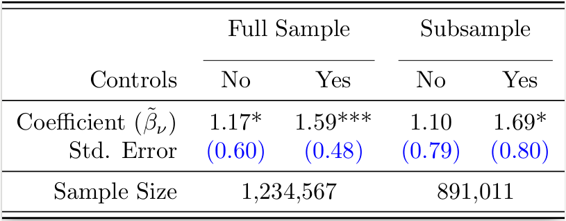

textables: Customized LaTeX tables in R
================
Created by Thibaut Lamadon and Bradley Setzler, University of Chicago

This package produces highly-customized LaTeX tables in R. There are two
key functions:

  - `TR`: Form a row in a LaTeX tabular environment.
  - `TS`: Compile a textable object to produce a PDF file of the table.

It supports building a table in blocks, in the spirit of ggplot2, using
the `+` and `%:%` operators for concatenation.

To install, run:

``` r
devtools::install_github("setzler/textables")
```

``` r
library(textables)
```

Here is an example of the type of table that this package can easily
construct:



# 1\. Character Rows with `TR`

### Purpose

When applied to a character vector, `TR` produces the row of a LaTeX
tabular.

`TR` supports LaTeX math mode, fonts, etc., but requires a double-escape
(two back slashes instead of the usual one in LaTeX).

### Example

``` r
vec <- c('Hello','\\textbf{World}','$\\alpha$','$\\frac{1}{2}$')

# produce a LaTeX tabular row
TR(vec)
```

    ## % created using textables on Fri May 15 11:24:27 PM 2020
    ## \begin{tabular}{r}
    ## Hello & \textbf{World} & $\alpha$ & $\frac{1}{2}$ \\
    ## \end{tabular}

# 2\. Numeric Rows with `TR`

### Purpose

When applied to a numeric vector, `TR` produces the row of a LaTeX
tabular. Numeric formatting options include:

  - `dec`: control decimal places, for example, `dec=3` displays 3
    decimal places;
  - `se`: surround numbers with parenthesis with `se=TRUE`;
  - `percentage`: add a percentage sign to each number with
    `percentage=TRUE`;
  - `pvalues`: use p-values to add stars to indicating significance, for
    example, `pvalues=c(0.005,0.05)` would add 3 stars and 2 stars,
    respectively.
  - `cspan`: column span.

We also provide the `surround` argument for a general syntax to modify
values. We could use it to change the font of each number in a row, as
shown in the example below.

Note that `dec` can be combined with any other options.

### Examples:

**Decimal places:** `dec`

``` r
vec <- c(1.0, 1.01, 1.001)

# round to the 2nd decimal place
TR(vec, dec=2)
```

    ## % created using textables on Fri May 15 11:24:28 PM 2020
    ## \begin{tabular}{r}
    ## 1.00 & 1.01 & 1.00 \\
    ## \end{tabular}

``` r
# different rounding for each value
TR(vec, dec=c(3,2,1))
```

    ## % created using textables on Fri May 15 11:24:28 PM 2020
    ## \begin{tabular}{r}
    ## 1.000 & 1.01 & 1.0 \\
    ## \end{tabular}

**Standard errors:** `se`

``` r
# treat all values as standard errors
TR(vec, se=T)
```

    ## % created using textables on Fri May 15 11:24:28 PM 2020
    ## \begin{tabular}{r}
    ## (1.0000) & (1.0100) & (1.0010) \\
    ## \end{tabular}

``` r
# treat some values as standard errors
TR(vec, dec=c(3,2,1), se=c(T,T,F))
```

    ## % created using textables on Fri May 15 11:24:28 PM 2020
    ## \begin{tabular}{r}
    ## (1.000) & (1.01) & 1.0 \\
    ## \end{tabular}

**Percent symbols:** `percentage`

``` r
# treat all values as percentages
TR(vec, percentage=T)
```

    ## % created using textables on Fri May 15 11:24:28 PM 2020
    ## \begin{tabular}{r}
    ## 1.0000\% & 1.0100\% & 1.0010\% \\
    ## \end{tabular}

``` r
# treat some values as percentages
TR(vec, dec=c(3,2,1), percentage=c(T,T,F))
```

    ## % created using textables on Fri May 15 11:24:28 PM 2020
    ## \begin{tabular}{r}
    ## 1.000\% & 1.01\% & 1.0 \\
    ## \end{tabular}

**Stars for statistical significance:** `pvalues`

``` r
# add stars by providing p-values
TR(vec, dec=c(3,2,1), pvalues=c(.01,.05,.1))
```

    ## % created using textables on Fri May 15 11:24:28 PM 2020
    ## \begin{tabular}{r}
    ## 1.000*** & 1.01** & 1.0* \\
    ## \end{tabular}

**General modification of each value:** `surround`

``` r
# turn all numbers red
TR(vec, surround = "{\\color{red} %s}")
```

    ## % created using textables on Fri May 15 11:24:28 PM 2020
    ## \begin{tabular}{r}
    ## {\color{red} 1.0000} & {\color{red} 1.0100} & {\color{red} 1.0010} \\
    ## \end{tabular}

**Column span:** `cspan`

``` r
# span two columns with the middle number
TR(vec, dec=c(3,2,1), cspan=c(1,2,1))
```

    ## % created using textables on Fri May 15 11:24:28 PM 2020
    ## \begin{tabular}{r}
    ## 1.000 & \multicolumn{2}{c}{1.01} & 1.0 \\
    ## \end{tabular}

# 3\. Concatenation

### Purpose

  - `+`: binds rows together vertically. It allows us to have multiple
    rows in a tabular.
  - `%:%`: binds columns together horizontally. It allows us to include
    both character and numeric vectors in the same row.

### Examples

``` r
# include character and numeric values in the same row
tab <- TR("Hello") %:% TR(c(1,2),percentage=T)

# bind with another row
tab + TR("\\textbf{World}") %:% TR(c(1,2),se=T)
```

    ## % created using textables on Fri May 15 11:24:28 PM 2020
    ## \begin{tabular}{rr}
    ## Hello & 1.0000\% & 2.0000\% \\
    ## \textbf{World} & (1.0000) & (2.0000) \\
    ## \end{tabular}

# 4\. Other Formatting Functions

### Purpose

  - `vspace`: add vertical space between rows.
  - `midrule`: add a horizontal line.
  - `midrulep`: add a partial horizontal line.

### Examples

**Vertical space:** `vspace`

``` r
# bind with another row separated by 3pt vertical space
tab + vspace(3) + TR("\\textbf{World}") %:% TR(c(1,2),se=T)
```

    ## % created using textables on Fri May 15 11:24:28 PM 2020
    ## \begin{tabular}{rr}
    ## Hello & 1.0000\% & 2.0000\% \\[3pt]
    ## \textbf{World} & (1.0000) & (2.0000) \\
    ## \end{tabular}

**Horizontal rule:** `midrule`

``` r
# bind with another row separated by horizontal line
tab + midrule() + TR("\\textbf{World}") %:% TR(c(1,2),se=T)
```

    ## % created using textables on Fri May 15 11:24:28 PM 2020
    ## \begin{tabular}{rr}
    ## Hello & 1.0000\% & 2.0000\% \\
    ## \midrule 
    ## \textbf{World} & (1.0000) & (2.0000) \\
    ## \end{tabular}

**Partial horizontal rule(s):** `midrulep`

``` r
# bind with another row separated by a partial horizontal line
tab + midrulep(list(c(2,3))) + TR("\\textbf{World}") %:% TR(c(1,2),se=T)
```

    ## % created using textables on Fri May 15 11:24:28 PM 2020
    ## \begin{tabular}{rr}
    ## Hello & 1.0000\% & 2.0000\% \\
    ##  \cmidrule(lr){2-3} 
    ## \textbf{World} & (1.0000) & (2.0000) \\
    ## \end{tabular}

# 5\. Export to PDF with `TS`

### Purpose

`TS` calls pdflatex to convert the textables object into a PDF file.

  - `file`: name of PDF (must end in `.pdf`)
  - `pretty_rules`: includes double-rules at the top and bottom of the
    table. Default is `TRUE`.
  - `header`: character vector with alignment of rows. Must be same
    length as number of rows.
  - `output_path`: Directory path in which to place the PDF. Default is
    `getwd()`, i.e., the current directory.

### Example

**Simple Example:**

``` r
tab <- TR("hello") %:% TR(0.1)

TS(tab, file="simple_example", pretty_rules=T, header=c('l','c'), output_path=paste0(getwd(),"/inst"))
```

**Complex Example:**

``` r
library(data.table)

dd <- data.table(
    sample = c("Full Sample", "Full Sample", "Subsample", "Subsample"), 
    controls = c("No", "Yes", "No", "Yes"), 
    coef = c(1.17, 1.59, 1.105, 1.69),
    SEs = c(.6, .481, .789, .8), 
    pvals = c(.051, .001, .16, .091), 
    N = c(1234567, 1234567, 891011, 891011)
  )


tab <- TR(c("","Full Sample","Subsample"),cspan=c(1,2,2)) +
  vspace(5) +
  midrulep(list(c(2,3),c(4,5))) +
  TR("Controls") %:% with(dd, TR(controls)) +
  midrule()

tab <- tab +  TR("Coefficient ($\\tilde{\\beta}_\\nu$)") %:% 
      with(dd, TR(coef, pvalues=pvals, dec=2)) +  
  TR("Std. Error") %:% with(dd, TR(SEs, se=T, dec=2, surround = "{\\color{blue} %s}"))  + 
  midrule() + TR("Sample Size") %:% 
      with(dd, TR(unique(N), cspan=c(2,2), dec=0))


TS(tab, file="complex_example", pretty_rules=T, header=c('r',rep('c',4)), output_path=paste0(getwd(),"/inst"))
```

The `complex_example` result is shown at the beginning of this document.
