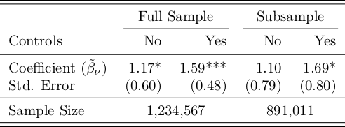

textables: Customized LaTeX tables in R
================
Created by Thibaut Lamadon and Bradley Setzler, University of Chicago

Overview
========

This package produces highly-customized LaTeX tables in R. The broad organization of functions is as follows:

-   `tt_numeric_*`: Functions to add numbers to tables;
-   `tt_text_*`: Functions to add text to tables;
-   `tt_rule_*`: Functions to add rules to tables;
-   `tt_spacer_*`: Functions to add spacing to tables;
-   `tt_tabularize` and `tt_save`: Functions to output the table to LaTeX.

It supports building a table in blocks, in the spirit of ggplot2, using the `+` and `%&%` operators for concatenation.

Here is an example of the type of table that this package can easily construct:



The package can be installed with the command `devtools::install_github("setzler/textables")`.

Details
=======

### Numeric Columns and Rows: `tt_numeric_*`

The functions for constructing numeric columns and rows are as follows:

-   `tt_numeric_column`: a numeric column; and,
-   `tt_numeric_row`: a numeric row.

Numeric formatting options include:

-   `dec`: control decimal places, for example, `dec=3` displays 3 decimal places;
-   `se`: surround numbers with parenthesis with `se=TRUE`;
-   `percentage`: add a percentage sign to each number with `percentage=TRUE`;
-   `pvalues`: use p-values to add stars to indicating significance, for example, `pvalues=c(0.005,0.05)` would add 3 stars and 2 stars, respectively.

### Text Columns and Rows: `tt_text_*`

The functions for constructing text columns and rows are:

-   `tt_text_column`: a text column (not yet supported); and,
-   `tt_text_row`: a text row.

Formatting options:

-   `cspan`: allows the text to span multiple columns, for example, `tt_text_row(c("hello","world"), cspan=c(2,3))` will have `hello` span 2 columns and `world` span 3 columns.

### Rules: `tt_rule_*`

-   `tt_rule_top`: add a top-rule;
-   `tt_rule_mid`: add a mid-rule;
-   `tt_rule_bottom`: add a bottom-rule;
-   `tt_midrule_partial`: add a partial mid-rule (user must supply begin and end points in a list of vectors, e.g., `tt_midrule_partial = list(c(1,2),c(3,4))`).

### Spacers: `tt_spacer_*`

-   `tt_spacer_row`: adds vertical space between rows, for example, `tt_spacer_rows(4.5)` adds 4.5pt of vertical space before the next row begins.

### Concatenation: `+` and `%&%` operators

-   `+`: binds columns together horizontally; and,
-   `%&%`: binds rows together vertically.

The output from `tt_numeric_column` and `tt_text_column` can be combined into a single table with `+`, while the output from `tt_numeric_row` and `tt_text_row` could be combined into a single table with `%&%`.

### Finishing and Exporting: `tt_tabularize` and `tt_save`

-   `tt_tabularize`: Converts a tt object into a tabular by collapsing into TeX code with begin/end tabular commands;
-   `tt_save`: save as a .tex file. The `stand_alone=T` option makes it a document that can be compiled directly by LaTeX. The `tabularize_output=T` option runs `tabularize` on the tt object before exporting.

Example
=======

This example demonstrates the construction of the example table seen at the beginning of this document.

### 1. Install and load the package

``` r
devtools::install_github("setzler/textables")
```

``` r
library(textables)
```

### 2. Construct example regression output

``` r
library(data.table)
```

    ## Warning: package 'data.table' was built under R version 3.3.2

``` r
dd <- data.table(
    sample = c("Full Sample", "Full Sample", "Subsample", "Subsample"), 
    controls = c("No", "Yes", "No", "Yes"), 
    coef = c(1.17, 1.59, 1.105, 1.69),
    SEs = c(.6, .481, .789, .8), 
    pvals = c(.051, .001, .16, .091), 
    N = c(1234567, 1234567, 891011, 891011)
  )

print(dd)
```

    ##         sample controls  coef   SEs pvals       N
    ## 1: Full Sample       No 1.170 0.600 0.051 1234567
    ## 2: Full Sample      Yes 1.590 0.481 0.001 1234567
    ## 3:   Subsample       No 1.105 0.789 0.160  891011
    ## 4:   Subsample      Yes 1.690 0.800 0.091  891011

### 3. Text rows, rules, and spacers

We start by creating a text row indicating whether or not controls are included:

``` r
tt <- with(dd, tt_text_row(controls)) 

print(tt)
```

    ## \begin{tabular}{r}
    ## No & Yes & No & Yes \\
    ## \end{tabular}

Note that, when printed to the console, a tt object will automatically include the begin/end tabular lines as a convenience in case the user wishes to test out the appearance of the table without relying on textable's exporting methods described below.

We append to this a row label, add 1pt of space, and follow it with a midrule:

``` r
tt <- tt_text_row("Controls") %&% tt + tt_spacer_row(1) + tt_rule_mid()

print(tt)
```

    ## \begin{tabular}{rr}
    ## Controls & No & Yes & No & Yes \\[1.000000pt]
    ## \midrule 
    ## \end{tabular}

We add a row above with labels that span multiple columns with matching partial midrules:

``` r
tt = tt_text_row(" ") %&% with(dd, tt_text_row(unique(sample), cspan=c(2, 2))) + 
  tt_rule_mid_partial(list(c(2,3),c(4,5)))  + tt

print(tt)
```

    ## \begin{tabular}{rr}
    ##   & \multicolumn{2}{c}{Full Sample} & \multicolumn{2}{c}{Subsample} \\
    ##  \cmidrule(lr){2-3} \cmidrule(lr){4-5} 
    ## Controls & No & Yes & No & Yes \\[1.000000pt]
    ## \midrule 
    ## \end{tabular}

### 4. Constructing numeric rows

We create a row of coefficient estimates with stars indicating significance and rounding to the third decimal place:

``` r
tt = tt +  tt_text_row("Coefficient ($\\tilde{\\beta}_\\nu$)") %&% with(dd, tt_numeric_row(coef, pvalues=pvals, dec=2))

print(tt)
```

    ## \begin{tabular}{rrrrr}
    ##   & \multicolumn{2}{c}{Full Sample} & \multicolumn{2}{c}{Subsample} \\
    ##  \cmidrule(lr){2-3} \cmidrule(lr){4-5} 
    ## Controls & No & Yes & No & Yes \\[1.000000pt]
    ## \midrule 
    ## Coefficient ($\tilde{\beta}_\nu$) & 1.17* & 1.59*** & 1.10 & 1.69* \\
    ## \end{tabular}

We add to this a row of standard errors:

``` r
tt = tt +  tt_text_row("Std. Error") %&% with(dd, tt_numeric_row(SEs, se=T, dec=2))

print(tt)
```

    ## \begin{tabular}{rrrrr}
    ##   & \multicolumn{2}{c}{Full Sample} & \multicolumn{2}{c}{Subsample} \\
    ##  \cmidrule(lr){2-3} \cmidrule(lr){4-5} 
    ## Controls & No & Yes & No & Yes \\[1.000000pt]
    ## \midrule 
    ## Coefficient ($\tilde{\beta}_\nu$) & 1.17* & 1.59*** & 1.10 & 1.69* \\
    ## Std. Error & (0.60) & (0.48) & (0.79) & (0.80) \\
    ## \end{tabular}

Finally, we add a row of sample size integers (note the automatic commas, which can be disabled with `big.mark=""`). We separate the sample size with a midrule:

``` r
tt = tt + tt_rule_mid() + tt_text_row("Sample Size") %&% with(dd, tt_numeric_row(N, dec=0))

print(tt)
```

    ## \begin{tabular}{rrrrr}
    ##   & \multicolumn{2}{c}{Full Sample} & \multicolumn{2}{c}{Subsample} \\
    ##  \cmidrule(lr){2-3} \cmidrule(lr){4-5} 
    ## Controls & No & Yes & No & Yes \\[1.000000pt]
    ## \midrule 
    ## Coefficient ($\tilde{\beta}_\nu$) & 1.17* & 1.59*** & 1.10 & 1.69* \\
    ## Std. Error & (0.60) & (0.48) & (0.79) & (0.80) \\
    ## \midrule 
    ## Sample Size & 1,234,567 & 1,234,567 & 891,011 & 891,011 \\
    ## \end{tabular}

### 5. Finishing and saving

We convert the tt object into a LaTeX tabular as follows:

``` r
tab = tt_tabularize(tt)

print(tab)
```

    ##  [1] "\\begin{tabular}{rrrrr}"                                                   
    ##  [2] "  & \\multicolumn{2}{c}{Full Sample} & \\multicolumn{2}{c}{Subsample} \\\\"
    ##  [3] " \\cmidrule(lr){2-3} \\cmidrule(lr){4-5} "                                 
    ##  [4] "Controls & No & Yes & No & Yes \\\\[1.000000pt]"                           
    ##  [5] "\\midrule "                                                                
    ##  [6] "Coefficient ($\\tilde{\\beta}_\\nu$) & 1.17* & 1.59*** & 1.10 & 1.69* \\\\"
    ##  [7] "Std. Error & (0.60) & (0.48) & (0.79) & (0.80) \\\\"                       
    ##  [8] "\\midrule "                                                                
    ##  [9] "Sample Size & 1,234,567 & 1,234,567 & 891,011 & 891,011 \\\\"              
    ## [10] "\\end{tabular}"

We can make the tabular prettier (top and bottom rules, left-align first column) as follows:

``` r
tab = tt_tabularize(tt, pretty_rules=T, left_align_first=T)

print(tab)
```

    ##  [1] "\\begin{tabular}{lrrrr}"                                                   
    ##  [2] "\\toprule "                                                                
    ##  [3] "\\midrule "                                                                
    ##  [4] "  & \\multicolumn{2}{c}{Full Sample} & \\multicolumn{2}{c}{Subsample} \\\\"
    ##  [5] " \\cmidrule(lr){2-3} \\cmidrule(lr){4-5} "                                 
    ##  [6] "Controls & No & Yes & No & Yes \\\\[1.000000pt]"                           
    ##  [7] "\\midrule "                                                                
    ##  [8] "Coefficient ($\\tilde{\\beta}_\\nu$) & 1.17* & 1.59*** & 1.10 & 1.69* \\\\"
    ##  [9] "Std. Error & (0.60) & (0.48) & (0.79) & (0.80) \\\\"                       
    ## [10] "\\midrule "                                                                
    ## [11] "Sample Size & 1,234,567 & 1,234,567 & 891,011 & 891,011 \\\\"              
    ## [12] "\\midrule "                                                                
    ## [13] "\\bottomrule "                                                             
    ## [14] "\\end{tabular}"

We can save the tabular to a .tex file with:

``` r
tt_save(tab,filename='inst/example.tex')
```

If we want to be able to compile the .tex file directly (rather than treat it as an input in another .tex file), we can use the `stand_alone=TRUE` option, then use R's `system` command to compile to PDF:

``` r
tt_save(tab,filename='inst/example.tex',stand_alone=T)

setwd("inst")
system("pdflatex example.tex")
```

The resulting table is displayed at the beginning of this document.
